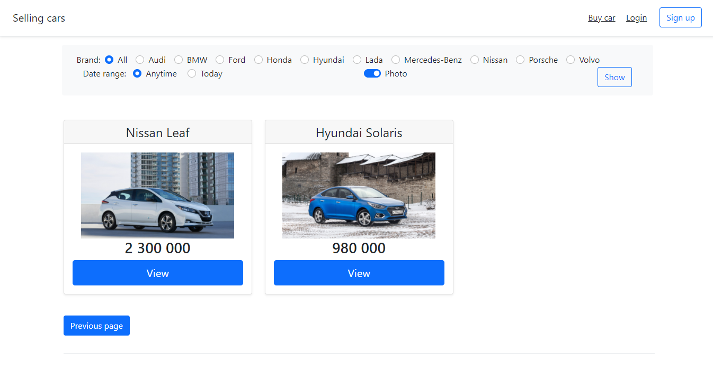
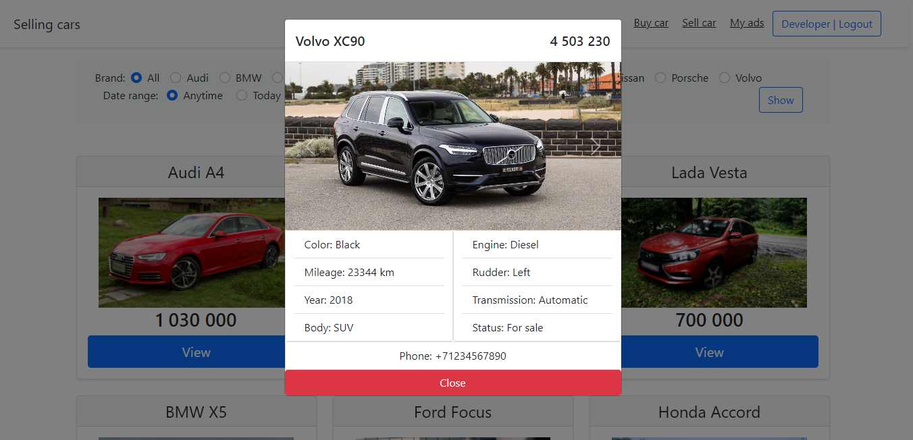

# job4j_cars

Техническое задание - Web приложение объявлений о продаже машин с использованием Hibernate.

Краткое описание проекта:
- Система регистрации и авторизации пользователей
- Пользователи могут публиковать объявления и изменять статус своих объявлений
- Система хранения паролей организованна в виде хэша (алгоритм + количество итераций + соль + хэш пароля)
- Система хранения паролей, позволяет менять алгоритм для новых паролей, сохраняя работоспособность старых паролей пользователей
- Фотографии объявлений сохраняются в директорию на жёстком диске
- Для загрузки фотографий используются возможности появившиеся в Servlet 3.0
- Возможность фильтровать отображение объявлений
- Постраничная загрузка объявлений
- Данные хранятся в базе данных PostgreSQL
- Управления данными для извлечения и сохранения в PostgreSQL осуществляется с помощью Hibernate
- Liquibase используется для начальной инициализации базы данных
- Фильтры для ограничения доступа не зарегистрированных пользователей к некоторым страницам сайта
- Шаблон DAO
   
   

В данном проекте использовались:
- Java 11
- Servlet, JSP, JSTL
- HTML, CSS, JavaScript, jQuery, Bootstrap - визуальное отображение
- PostgreSQL, Liquibase, Hibernate - все данные хранились в БД. По мере необходимости извлекались и использовались
- Mockito, JUnit5, HSQLDB - Использовались для тестирования проекта
- JSON - Использовался для обмена данными между jQuery и Servlet
- JaCoCo, Checkstyle
- SLF4J, Logback - Ведение логов в проекте
   
   

Схема базы данных: 

  
Главная страница. Присутствует фильтр для отображения определёных объявлений. Обновление данных страницы происходит без перезагрузки всей страницы:

  
На главную страницу из базы данных объявления загружаются порциями. Пользователь может пролистывать страницы кнопками "Previous page" и "Next page":

  
Детальный просмотр объявления:

  
Форма авторизации пользователя:

  
Форма регистрации пользователя:

  
Форма добавления нового объявления:

  
Страница, где отображаются все объявления пользователя. Можно менять статус объявления:

  